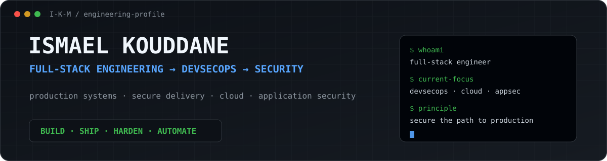

<p align="center">
  
</p>

<p align="center">
  <strong>Full-Stack Engineer → DevSecOps & Security Engineering</strong>
</p>

<p align="center">
  Building production systems — and going deeper into securing how they are built, shipped and operated.
</p>

<p align="center">
  <code>BUILD</code> · <code>SHIP</code> · <code>HARDEN</code> · <code>AUTOMATE</code>
</p>

---

## Engineering background

I come from full-stack development and production engineering.

I work across web applications, APIs, CMS platforms, infrastructure, integrations, automation and AI systems — from implementation to deployment, maintenance and production incidents.

I'm now moving deeper into **DevSecOps, Cloud Security and Security Engineering**, with a particular interest in the boundary between application code and the infrastructure that runs it.

```text
Application
    ↓
CI/CD
    ↓
Containers
    ↓
Linux
    ↓
Infrastructure
    ↓
Cloud
    ↓
Security
```

---

## Current focus

```text
DevSecOps        CI/CD security · supply chain · secure delivery
Cloud Security   AWS · IAM · infrastructure security
Linux            hardening · networking · services · observability
Containers       Docker · isolation · capabilities · image security
AppSec           web security · authentication · APIs · secure design
Automation       Bash · Python · Go · security tooling
```

I still build applications.

I just spend increasingly more time thinking about what happens **between `git push` and production** — and what can go wrong there.

---

## Selected engineering work

### [Secbox](https://github.com/I-K-M/secbox)

**Hardened security toolbox with a verified DevSecOps delivery pipeline.**

`Docker` `GitHub Actions` `Trivy` `CycloneDX` `Cosign` `Linux`

- non-root default runtime
- read-only root filesystem
- explicit Linux capabilities
- amd64 / arm64 native builds
- repository and image vulnerability scanning
- runtime security tests
- SBOM generation
- keyless container signing

---

### [VPSGuard](https://github.com/I-K-M/vpsguard)

**Interactive Ubuntu VPS auditing and hardening assistant.**

`Bash` `Linux` `SSH` `UFW` `Fail2ban` `AppArmor` `Nginx`

Audits first, preserves the current access path and validates changes before reload.

---

### [WP Security](https://github.com/I-K-M/wp_security)

**WordPress security assessment tooling in Go and Bash.**

`Go` `Bash` `WordPress` `HTTP` `AppSec`

A bridge between the web platforms I've worked with for years and the security engineering I'm moving deeper into.

---

### [Secure Lead Intake](https://github.com/I-K-M/secure-lead-intake)

**Reusable full-stack lead ingestion pipeline with layered defensive controls.**

`PHP` `JavaScript` `APIs` `Rate Limiting` `Validation`

Server-side validation, anti-spam controls, CRM synchronization and internal notifications.

---

### [Garden Planner](https://github.com/I-K-M/gardenPlanner)

**React / TypeScript application work representing the software engineering base behind the security transition.**

`TypeScript` `React` `Vite` `Vitest` `Playwright` `Supabase`

---

## Toolbox

### Security & infrastructure

<p>
  
</p>

`IAM` · `Networking` · `GitHub Actions` · `Trivy` · `Cosign` · `SBOM` · `Nmap` · `Wireshark`

### Software engineering

<p>
  
</p>

`FastAPI` · `Flask` · `REST APIs` · `WordPress` · `Shopify` · `Qdrant` · `LangChain` · `LangGraph`

---

## Security engineering path

Currently going deeper into:

- AWS IAM and cloud security
- CI/CD and software supply-chain security
- Linux and container hardening
- web application security
- infrastructure as code
- security automation
- AI / agent security

The objective is not to leave software engineering behind.

It's to understand and secure more of the system around the software.

---

## Working with [Talk Digital](https://talkdigital.com.au)

I work across production web applications and internal tooling: application development, integrations, deployment, automation, AI systems, debugging, production incidents, infrastructure and security improvements.

---

<p align="center">
  <strong>Build systems. Understand them. Break assumptions. Harden the result.</strong>
</p>
